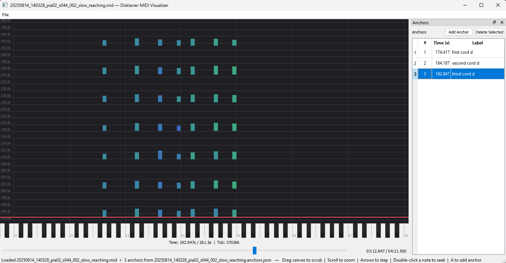

# Disklavier MIDI Visualizer

A small PyQt5 desktop app for inspecting Disklavier MIDI recordings as a falling-keys piano roll. Pick a `.mid` file, scrub through it, zoom in or out, mark moments of interest as **anchors**, and save the anchor list as a JSON sidecar. Pure visualization — no audio playback, no MIDI editing.



## Install

```powershell
python -m venv .venv
.venv\Scripts\activate
pip install -r requirements.txt
```

For development (tests):

```powershell
pip install -r requirements-dev.txt
```

## Run

```powershell
python -m disklavier_visualizer
```

Then **File → Open…** (or ++Ctrl+O++) to pick a `.mid` file (or a saved `.anchors.json` to restore a session).

## Documentation

**📖 [Read the docs](https://haowenweijohn.github.io/disklavier_midi_visualizer/)**

To build and serve the docs locally:

```powershell
pip install -r requirements-docs.txt
mkdocs serve
```

Open [http://localhost:8000](http://localhost:8000) to browse. The docs are organised into:

- **§1 Overview** — what the tool is and what it deliberately doesn't do.
- **§2 Getting started** — installation and a five-minute first-launch walkthrough.
- **§3 Reference** — per-component pages for the main window, MIDI canvas, timeline slider, anchor table, and a keyboard shortcuts cheat sheet.
- **§4 Project files** — the anchor save/load workflow and the JSON v1 schema.
- **§5 Troubleshooting** — known issues and FAQ.

## Tests

```powershell
pytest
```

Test coverage:

- `tests/test_midi_adapter.py` — MIDI parsing, error handling.
- `tests/test_anchor_io.py` — JSON round-trip, sort-on-save, schema rejection.
- `tests/test_anchor_table.py` — Anchor widget add/sort/delete/jump/label edit/signals.
- `tests/test_note_data.py` — Visibility-range logic.
- `tests/test_velocity_color.py` — Colormap stops and interpolation.
- `tests/test_smoke.py` — End-to-end MainWindow wiring (requires `pytest-qt`).

For manual UI verification, see [`docs/manual_test.md`](docs/manual_test.md).

## Project layout

```
disklavier_visualizer/
├── app.py             — QApplication bootstrap
├── __main__.py        — `python -m disklavier_visualizer` entry point
├── io/
│   ├── midi_adapter.py    — mido + pretty_midi MIDI parser
│   └── anchor_io.py       — anchor JSON sidecar save/load (schema v1)
└── ui/
    ├── main_window.py     — QMainWindow shell, menu, file dispatch, signal wiring
    ├── midi_canvas.py     — falling-keys QPainter visualization
    ├── timeline_slider.py — bottom scrubber, click-to-jump
    └── anchor_table.py    — dockable anchor list (#, Time(s), Label)
```

The MIDI parser, falling-keys canvas, and anchor table are adapted from the sibling [`midi_camera_alignment_tool`](https://github.com/HaowenWeiJohn/midi_camera_alignment_tool) project, trimmed for a standalone visualizer.
